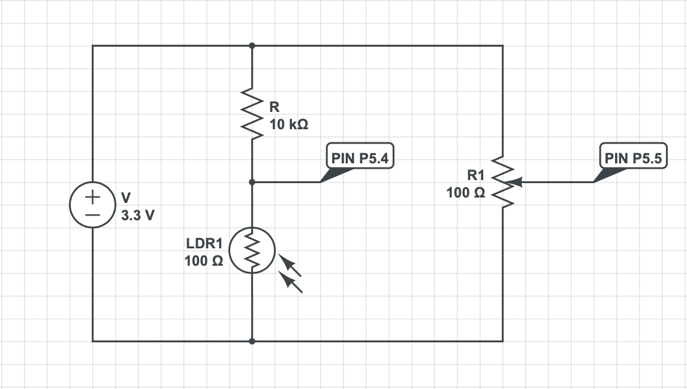
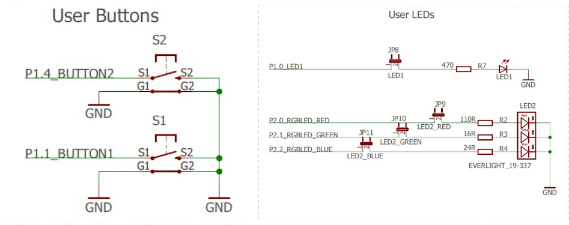

# recruiting-sw-microcontrollers
E-Agle recruiting project

## CIRCUIT DESIGN
To let `system_voltage` change, a potentiometer is used (as required). The sensor is connected to pin P5.5, configurated as analog input (A0).

A photoresistor has been chosen as analog sensor. A voltage divider has been set up using the photoresistor and a 10kOhm resistor. The sensor voltage is measured using pin P5.4 (analog input A1).
Then, this value is used to calculate the environment luminosity (in lumen). To do so, 2 conversions are provided:
* voltage to resistance, using the voltage divider formula

$R = \frac {10k\Omega \cdot system\_voltage}{3.3V - system\_voltage}$

* resistance to luminosity: the relation resistance-luminosity is defined by a hyperbolic function. For the sake of simplicity and because it was not feasible to calibrate the sensor, the following equation has been used

$luminosity = \frac{500000}{resistance}$

Two LEDs have been configurated to report a system_voltage fault (i.e. `DANGER` state):
* Red LED (pin P2.0) will turn on in case of OVERVOLTAGE
* Blue LED (pin P2.2) will turn on in case of UNDERVOLTAGE
These LEDs are integrated into the board.

The left-side button (pin P1.1) has been configurated to enter and exit `EMERGENCY` mode.

## FINITE STATE MACHINE DESIGN
A brief overview of the FSM design will be now provided.

### INIT STATE
At the beginning of the execution, the system enters `INIT` state. A configuration routine has been provided to initialize all parameters and modules needed by the system.
Once everything is set up, the system enters `RUNNING` mode.

### RUNNING STATE
When in `RUNNING` state, the system performs default tasks, such as:
* reading from the analog sensor and calculating the environment luminosity every 200ms. For this purpose, `TIMER_A0` is set up.
* check the `system_voltage` every 350ms and change the state if needed. For this purpose, `TIMER_A1` is set up.
Both timers have a clock source at a frequency of 3MHz (`TIMER_A_CLOCKSOURCE_SMCLK`).
It's always possible to activate `EMERGENCY` mode using the corresponding button.

### DANGER STATE
Activating this state means that a voltage malfunction has been detected.
As specified above, in case of `overvoltage`, the red LED will turn on; otherwise, in case of `undervoltage`, the blue one will.

When the `system_voltage` is back to normal, the LEDs are turned off and the system gets back to `RUNNING` state.

All this tasks are performed inside the handler of the corresponding timer (`TA0_N_IRQHandler` and `TA1_N_IRQHandler`).

It's still possible to enter `EMERGENCY` mode from this state.

### EMERGENCY STATE
When pushing the button, the system enters this mode.
All timers' (`INT_TA0_N` e `INT_TA1_N`) and ADC's (`INT_ADC14`) interrupts are disabled. 
Every 500 ms, an alert will be prompted on the console to report to the user that the system is in `EMERGENCY` mode (implemented using busy waiting).

When the button is pushed for the second time, the current status is switched to `RUNNING`, and this happens independently of the status of the system before entering `EMERGENCY` mode. This implementation has been chosen to ensure all the values are updated after exiting this mode.
The commented section of the code defines another way of implementing this, in which the previous status of the system is restored.

## Additional notes
All functions in the code are commented. Check the source files for more details.