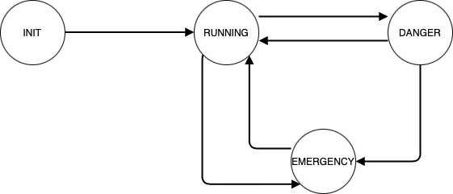

# recruiting-sw-microcontrollers
E-Agle recruiting project

## CIRCUITO
Per la lettura di `system_voltage` viene usato un potenziometro (come da specifiche) collegato al pin P5.5 della scheda, il quale viene configurato come pin analogico (A0).

Come sensore viene utilizzata una fotoresistenza. La tensione ai capi viene rilevata dal pin P5.4, impostato come analogico (A1). In seguito alla lettura, il valore rilevato viene stampato in console.

Per quanto riguarda i LED per segnalare lo stato `DANGER`, vengono usati quelli integrati nella scheda (LED RGB).
* OVERVOLTAGE: viene usato il led RED, accessibile tramite il pin P2.0
* UNDERVOLTAGE: viene usato il led BLUE, accessibile tramite il pin P2.2

Il bottone collegato al pin P1.1 è stato impostato per la gestine dello stato `EMERGENCY`

## FINITE STATE MACHINE
Viene proposta ora una rapida overview del design della macchina a stati.

### INIT
Lo stato `INIT` prevede solamente la configurazione di tutti i parametri e moduli necessari alla gestione del sistema. Il sistema è avviato con questo stato e una volta concluso, entra direttamente in `RUNNING`

### RUNNING
In questo stato il sistema effettua la lettura dei sensori tramite ADC.

Vengono utilizzati due timer per la gestione della lettura dei sensori:
* TIMER_A0 per la lettura di `system_voltage`
* TIMER_A1 per la lettura del sensore

Il clock in input ad entrambi ha una frequenza di 3MHz (`TIMER_A_CLOCKSOURCE_SMCLK`).

Si passa in stato `DANGER` se viene rilevato un livello di tensione anomalo (come da specifiche).

È possibile passare in stato `EMERGENCY` premento il bottone.

### DANGER
In questo stato, il sistema continua la lettura dai sensori e la conversione AD. Se siamo in una situazione di `overvoltage`, si accende il led ROSSO; nel caso di `undervoltage` si accende quello blu.

Se la tensione rientra nei limiti consentiti, viene impostato lo stato `RUNNING` e il led viene spento.

È possibile passare in stato `EMERGENCY` premento il bottone.

### EMERGENCY
Quando il sistema è in questo stato, vengono disattivati gli interrupt relativi ai timer (`INT_TA0_N` e `INT_TA1_N`) e alla conversione AD (`INT_ADC14`). Viene stampato a schermo lo stato del sistema (implementato con busy waiting).

Quando viene premuto il bottone per uscire da `EMERGENCY`, viene imposto il passaggio a `RUNNING`, indipendentemente dallo stato del sistema prima della chiamata di emergenza. Nonostante nel codice sia presente anche un'alternativa che ripristina il sistema allo stato precedente a quello di emergenza (sezione commentata), è stato scelto di implementarlo in questo modo per tenere conto di eventuali variazioni che non sono state rilevate perchè in stato `EMERGENCY`. Imponendo quindi il passaggio per `RUNNING`, nel primo ciclo di esecuzione aggiorniamo lo stato del sistema e, se necessario, si passa a `DANGER`.

